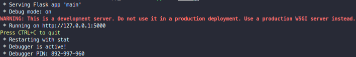

# FlaskApiRest
Projeto API Rest Python em Flask 


## Como rodar a aplicação
Você deve criar um virtualenv e instalar as dependências que estão salvas em _requirements.txt_. Para executar a aplicação, basta chamar o arquivo main com o interpretador do python, da seguinte forma:

```bash
$ python main.py
```

A aplicação será executada em _localhost_ na porta padrão 5000, conforme podemos verificar abaixo.

